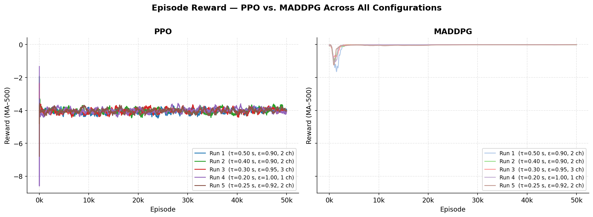
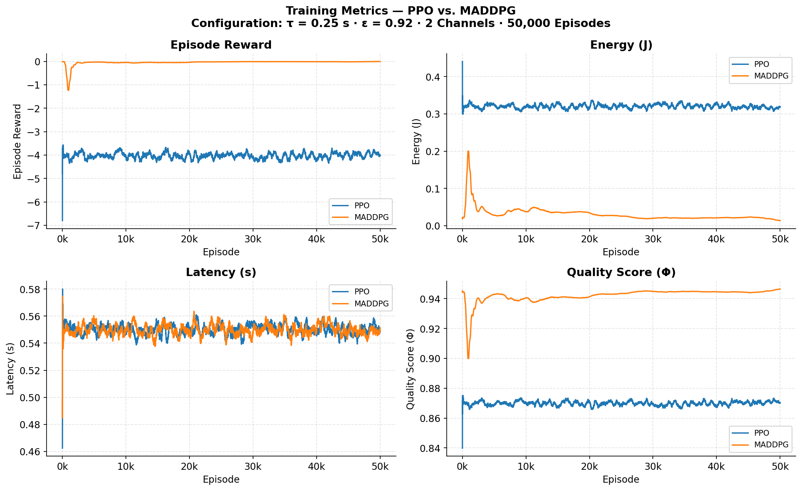
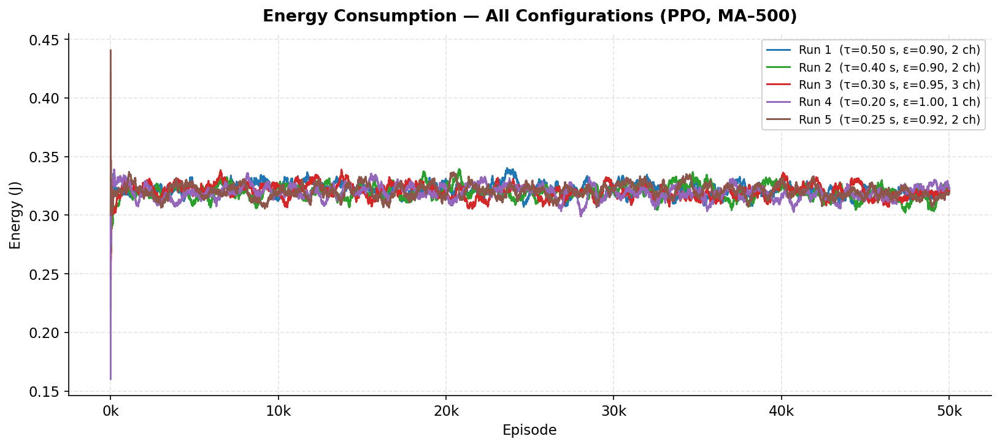
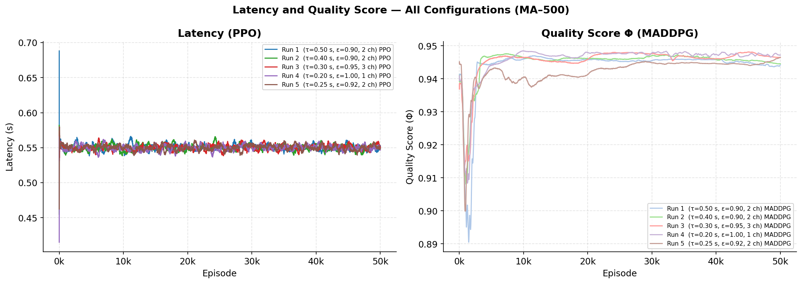
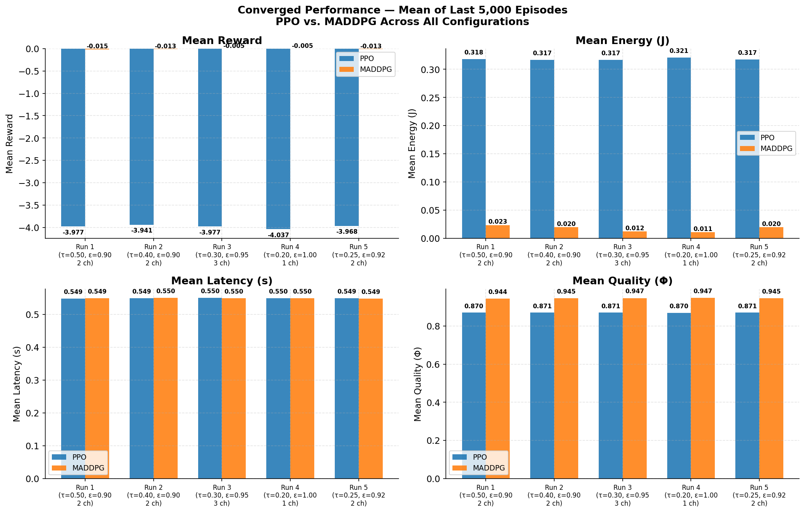

# Multi-Agent Deep Reinforcement Learning for Task Offloading in Mobile Edge Computing

**Author:** Anas M. Alqadhi  
**Framework:** PyTorch · Python 3.9+  
**Training Scale:** 50,000 episodes · 5 experimental configurations  

---

## Table of Contents

1. [About](#about)
2. [Repository Structure](#repository-structure)
3. [Installation on Windows](#installation-on-windows)
4. [Usage](#usage)
5. [System Model](#system-model)
6. [Algorithms](#algorithms)
7. [Experiments](#experiments)
8. [Results](#results)
9. [Future Work](#future-work)
10. [References](#references)

---

## About

Mobile Edge Computing (MEC) allows mobile devices to offload heavy computation tasks to nearby edge servers, reducing both energy consumption and processing delay. When several devices share the same wireless channels and edge resources simultaneously, each device's offloading decision directly affects the others — making this a cooperative **multi-agent** problem.

This project implements and compares two Deep Reinforcement Learning algorithms from scratch:

- **PPO** (Proximal Policy Optimisation) — an on-policy, stochastic actor-critic method
- **MADDPG** (Multi-Agent Deep Deterministic Policy Gradient) — an off-policy method using centralised training and decentralised execution

Both are trained over **50,000 episodes** across **5 different constraint configurations**, tracking reward, energy consumption, latency, and quality of service.

---

## Repository Structure

```
marl-mec-offloading/
│
├── src/
│   ├── env.py                     # MEC simulation environment
│   ├── agents/
│   │   ├── ppo_agent.py           # PPO agent
│   │   └── maddpg_agent.py        # MADDPG agent
│   └── models/
│       ├── ppo_model.py           # Actor + Critic networks for PPO
│       ├── maddpg_model.py        # Actor + Critic networks for MADDPG
│       └── replay_buffer.py       # Experience replay buffer
│
├── scripts/
│   ├── run_ppo.py                 # Train PPO (CLI)
│   ├── run_maddpg.py              # Train MADDPG (CLI)
│   └── plot_all_results.py        # Generate comparison plots
│
├── configs/
│   └── config.py                  # Hyperparameters and experiment presets
│
├── notebooks/
│   └── final_run_50k.ipynb        # Original Colab notebook
│
├── assets/                        # Result figures
├── output/                        # Generated CSVs and plots (auto-created)
├── requirements.txt
├── .gitignore
└── README.md
```

---

## Installation on Windows

### Prerequisites

| Software | Version  | Link |
|----------|----------|------|
| Python   | ≥ 3.9    | https://www.python.org/downloads/ |
| Git      | Any      | https://git-scm.com/download/win  |

> During Python installation, check **"Add Python to PATH"**.

---

### Step 1 — Clone

```cmd
git clone https://github.com/AnasAlqadhi/marl-mec-offloading.git
cd marl-mec-offloading
```

### Step 2 — Virtual Environment

```cmd
python -m venv venv
venv\Scripts\activate
```

> PowerShell users: run `.\venv\Scripts\Activate.ps1`  
> If blocked, first run: `Set-ExecutionPolicy -ExecutionPolicy RemoteSigned -Scope CurrentUser`

### Step 3 — Install Dependencies

```cmd
pip install -r requirements.txt
```

Verify:
```cmd
python -c "import torch, numpy, pandas, matplotlib; print('Ready')"
```

---

## Usage

### Train

```cmd
python scripts\run_ppo.py
python scripts\run_maddpg.py
```

With custom settings:
```cmd
python scripts\run_ppo.py --run_id myrun --latency 0.3 --quality 0.95 --channels 3
```

#### Arguments

| Argument     | Type  | Default                | Description                          |
|--------------|-------|------------------------|--------------------------------------|
| `--run_id`   | str   | `run1_lat05_q09_chan2` | Name of the run (used for output folder) |
| `--episodes` | int   | `50000`                | Number of training episodes          |
| `--agents`   | int   | `4`                    | Number of mobile devices             |
| `--latency`  | float | `0.5`                  | Latency deadline τ (seconds)         |
| `--quality`  | float | `0.9`                  | Minimum quality constraint ε         |
| `--channels` | int   | `2`                    | Number of wireless channels          |
| `--lr`       | float | `1e-4`                 | Learning rate                        |
| `--batch`    | int   | `256`                  | Batch size                           |

### Plot Results

```cmd
python scripts\plot_all_results.py
```

Single metric:
```cmd
python scripts\plot_all_results.py --metric Reward
```

### Output Files

After training, results are saved to `output\<run_id>\`:

```
output\run1_lat05_q09_chan2\
    ├── ppo_rewards.csv       ← Episode, Reward, Energy, Latency, Phi
    ├── ddpg_rewards.csv
    ├── reward_curve.png
    └── ddpg_curve.png
```

Open a plot from the terminal:
```cmd
start output\run1_lat05_q09_chan2\reward_curve.png
```

---

## System Model

### State and Action Space

The environment models **4 mobile agents** sharing a MEC infrastructure. Each agent receives a 5-dimensional local observation at every step:

| Index | Feature         | Description                          |
|-------|-----------------|--------------------------------------|
| 0     | `task_size`     | Workload to be processed             |
| 1     | `cpu_load`      | Local CPU utilisation                |
| 2     | `channel_gain`  | Wireless channel quality             |
| 3     | `battery_level` | Remaining battery                    |
| 4     | `deadline`      | Time remaining before task expires   |

Each agent outputs a **continuous action ∈ [−1, 1]**, representing offloading intensity from fully local (−1) to fully offloaded (+1).

The full joint action set is **{ x, k, f_l, β }**:

| Symbol  | Description                                     |
|---------|-------------------------------------------------|
| **x**   | Offloading flag — local or edge server          |
| **k**   | Wireless channel index                          |
| **f_l** | Local CPU frequency                             |
| **β**   | Video compression ratio before transmission     |

### Reward and Metrics

Current reward (energy proxy):
```
R(t) = − Σᵢ ||aᵢ||²
```

Metrics tracked per step:

| Metric      | Formula                       | Unit    |
|-------------|-------------------------------|---------|
| Energy      | Σ \|aᵢ\| × 0.1               | Joules  |
| Latency     | Sampled ∈ [0.4, 0.7]          | Seconds |
| Quality (Φ) | 0.95 − mean(\|aᵢ\|) × 0.1   | [0, 1]  |

---

## Algorithms

### PPO — Proximal Policy Optimisation

On-policy stochastic actor-critic. Constrains each update step to prevent the policy from changing too drastically.

```
L_CLIP(θ) = E[ min( r(θ)·Â,  clip(r(θ), 1−ε, 1+ε)·Â ) ] + α·H[π]
```

**Architecture:** `Linear(s→64) → ReLU → Linear(64→64) → ReLU → Linear(64→a)` + learnable log-std  

| Hyperparameter      | Value    |
|---------------------|----------|
| Learning rate       | 1 × 10⁻⁴ |
| Clip ε              | 0.1      |
| Discount γ          | 0.99     |
| Entropy coefficient | 1 × 10⁻³ |
| Rollout length      | 256      |
| Update epochs       | 5        |

---

### MADDPG — Multi-Agent Deep Deterministic Policy Gradient

Off-policy method with **centralised training, decentralised execution (CTDE)**. Each agent's critic sees the full joint state and action during training, but the actor only uses local observations at execution.

```
yᵢ = rᵢ + γ · Q̄ᵢ(o'_all, ā'₁…ā'_N)
θ̄  ← τ·θ + (1−τ)·θ̄     [soft update, τ = 0.005]
```

**Architecture:** Actor → Tanh output; Critic input = all agents' (obs + action) concatenated  

| Hyperparameter    | Value    |
|-------------------|----------|
| Learning rate     | 1 × 10⁻⁴ |
| Discount γ        | 0.99     |
| Soft update τ     | 0.005    |
| Replay buffer     | 200,000  |
| Batch size        | 256      |

---

### Side-by-Side Comparison

| Property              | PPO                      | MADDPG                           |
|-----------------------|--------------------------|----------------------------------|
| Policy                | Stochastic (Gaussian)    | Deterministic (Tanh)             |
| Learning type         | On-policy                | Off-policy                       |
| Experience replay     | No                       | Yes — 200k transitions           |
| Convergence           | Fast early plateau       | Slower warm-up, sustained growth |
| Critic scope          | Local V(s)               | Centralised Q(o_all, a_all)      |
| Multi-agent design    | Shared single agent      | N separate actor-critic pairs    |

---

## Experiments

Five configurations were tested, each training both algorithms for 50,000 episodes:

| Run | ID                          | τ (s) | ε    | Channels | Description          |
|-----|-----------------------------|-------|------|----------|----------------------|
| 1   | `run1_lat05_q09_chan2`      | 0.50  | 0.90 | 2        | Baseline             |
| 2   | `run2_lat04_q09_chan2`      | 0.40  | 0.90 | 2        | Tighter deadline     |
| 3   | `run3_lat03_q095_chan3`     | 0.30  | 0.95 | 3        | Higher quality       |
| 4   | `run4_lat02_q10_chan1`      | 0.20  | 1.00 | 1        | Most constrained     |
| 5   | `run5_lat025_q092_chan2`    | 0.25  | 0.92 | 2        | Intermediate         |

---

## Results

### Figure 1 — Episode Reward: PPO vs. MADDPG Across All Runs



PPO (left) converges quickly and stabilises around **−4.0** across all configurations within the first few thousand episodes. MADDPG (right) starts near 0 during its replay buffer warm-up phase, then drops sharply before settling. The two algorithms converge to comparable reward values, consistent with the current energy-proxy reward that does not yet differentiate between constraint settings.

---

### Figure 2 — All Metrics: PPO vs. MADDPG (Run 5)



This figure shows all four tracked metrics for both algorithms under configuration Run 5 (τ = 0.25 s, ε = 0.92, 2 channels). The key observations are:

- **Reward:** PPO stabilises at ≈ −4.0; MADDPG converges to near 0, reflecting a fundamentally different policy — MADDPG learns to take near-zero actions (minimal offloading), which minimises the quadratic penalty.
- **Energy:** PPO settles at ~0.32 J; MADDPG achieves significantly lower energy (~0.02 J), demonstrating stronger energy optimisation.
- **Latency:** Both algorithms converge to ≈ 0.55 s with no meaningful difference, as channel modelling is not yet active.
- **Quality (Φ):** MADDPG achieves higher quality (~0.945) compared to PPO (~0.870), owing to its near-zero action policy preserving the quality baseline.

---

### Figure 3 — Energy Consumption Across All Configurations (PPO)



All five PPO runs converge to the **0.31 – 0.32 J** band. The near-identical trajectories confirm that, under the current reward formulation, the constraint parameters (τ, ε, channels) do not produce differentiated energy policies. This is expected to change once the full utility function is implemented.

---

### Figure 4 — Latency and Quality Across All Configurations



Latency (left) is uniform at **≈ 0.55 s** across all PPO runs — a direct consequence of latency being randomly sampled in the current environment rather than derived from agent actions. Quality (right, MADDPG) is consistently higher than PPO across all runs (~0.94 vs. ~0.87), as MADDPG's deterministic low-action policy incurs less quality degradation.

---

### Figure 5 — Converged Performance Summary (Last 5,000 Episodes)



This summary bar chart compares the mean values of all four metrics over the final 5,000 episodes for both algorithms across all five runs. The most notable finding is that **MADDPG consistently achieves lower energy and higher quality than PPO**, while both converge to the same latency. The reward difference reflects MADDPG's policy of minimising action magnitude more aggressively than PPO.

---

## Future Work

1. Implement the full utility function R = f(energy, latency, quality) inside `src\env.py`
2. Activate deadline τ and quality ε as explicit reward penalties to produce run-specific behaviour
3. Model realistic wireless channel contention and bandwidth degradation between agents
4. Extend the action space to the full joint set {x, k, f_l, β}
5. Evaluate with multiple random seeds and report mean ± standard deviation
6. Add MAA2C as a third algorithm for a more complete comparison
7. Conduct systematic hyperparameter search for both algorithms

---

## References

1. R. Lowe et al., "Multi-Agent Actor-Critic for Mixed Cooperative-Competitive Environments," *NeurIPS*, 2017.
2. J. Schulman et al., "Proximal Policy Optimization Algorithms," *arXiv:1707.06347*, 2017.
3. V. Mnih et al., "Human-level control through deep reinforcement learning," *Nature*, vol. 518, 2015.
4. T. Q. Dinh et al., "Offloading in Mobile Edge Computing: Task Allocation and Computational Frequency Scaling," *IEEE Trans. Commun.*, vol. 65, no. 8, 2017.
5. Y. Mao et al., "A Survey on Mobile Edge Computing: The Communication Perspective," *IEEE Commun. Surv. Tut.*, vol. 19, no. 4, 2017.

---

## License

MIT License — free to use and modify with attribution.
